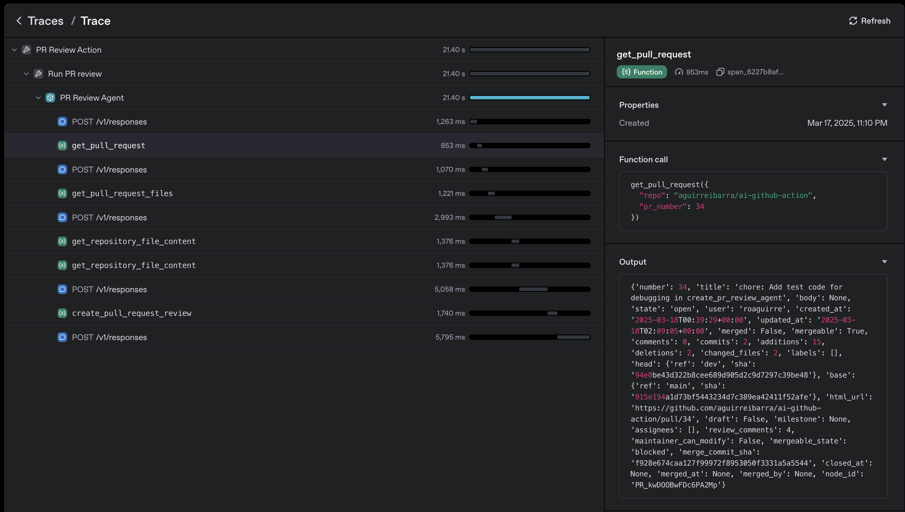

# AI GitHub Action 🤖

> Supercharge your GitHub workflow with AI-powered automation

[](https://github.com/aguirreibarra/ai-github-action/stargazers)
[](https://opensource.org/licenses/MIT)
[](https://github.com/aguirreibarra/ai-github-action/releases)

## ✨ Overview

AI GitHub Action leverages the OpenAI Agents framework to bring intelligent automation to your GitHub workflows. This action can analyze pull requests, issues, and code repositories to provide insightful feedback, automated code reviews, and helpful responses - all powered by OpenAI's advanced AI models.

<p align="center">
  
</p>

## 🚀 Key Features

- **Automated PR Reviews** - Get comprehensive code quality feedback with automatic PR approval for high-quality contributions
- **Issue Analysis** - Receive AI-generated responses to issues with categorization and prioritization
- **Code Scanning** - Identify security vulnerabilities and best practice violations across your codebase
- **Custom Instructions** - Tailor the AI behavior to focus on your project's specific needs
- **Tracing** - Powered by OpenAI's Agent SDK with built-in tracing through the OpenAI platform.

## 📋 Usage Examples

### Pull Request Review

```yaml
name: AI PR Review

on:
  pull_request:
    types: [opened, synchronize]

jobs:
  pr-review:
    runs-on: ubuntu-latest
    permissions:
      contents: read
      pull-requests: write
    steps:
      - name: AI PR Review
        uses: aguirreibarra/ai-github-action@main
        with:
          action-type: pr-review
          openai-api-key: ${{ secrets.OPENAI_API_KEY }}
          github-token: ${{ secrets.GITHUB_TOKEN }}
          custom-prompt: "Focus on security best practices and performance optimization"
```

The PR Review Action will analyze pull requests and post feedback by submiting a pull request review. The AI will provide specific feedback directly on code lines.

### Issue Analyzer

```yaml
name: AI Issue Analysis

on:
  issues:
    types: [opened, labeled]

jobs:
  analyze:
    permissions:
      issues: write
    runs-on: ubuntu-latest
    if: github.event.action == 'opened' || contains(github.event.issue.labels.*.name, 'needs-triage')
    steps:
      - name: AI Issue Analysis
        uses: aguirreibarra/ai-github-action@main
        with:
          action-type: issue-analyze
          openai-api-key: ${{ secrets.OPENAI_API_KEY }}
          github-token: ${{ secrets.GITHUB_TOKEN }}

      - name: Remove needs-triage label
        uses: actions/github-script@v7
        with:
          github-token: ${{ secrets.GITHUB_TOKEN }}
          script: |
            try {
              await github.rest.issues.removeLabel({
                owner: context.repo.owner,
                repo: context.repo.repo,
                issue_number: context.issue.number,
                name: 'needs-triage'
              });
            } catch (e) {
              // Label might not exist, that's okay
            }
```

### Code Scanning

```yaml
name: AI Code Scan

on:
  push:
    branches: [main]
  schedule:
    - cron: '0 0 * * 1'  # Weekly scan
  workflow_dispatch: # Allow manual runs

jobs:
  scan:
    permissions:
      contents: read
      issues: write
    runs-on: ubuntu-latest
    steps:
      - name: AI Code Scan
        uses: aguirreibarra/ai-github-action@main
        with:
          action-type: code-scan
          openai-api-key: ${{ secrets.OPENAI_API_KEY }}
          github-token: ${{ secrets.GITHUB_TOKEN }}
```

### Documentation Generation

```yaml
name: AI Documentation Generation

on:
  workflow_dispatch:

jobs:
  doc-gen:
    runs-on: ubuntu-latest
    steps:
      - name: AI Documentation Generation
        uses: aguirreibarra/ai-github-action@main
        with:
          action-type: doc-gen
          openai-api-key: ${{ secrets.OPENAI_API_KEY }}
          github-token: ${{ secrets.GITHUB_TOKEN }}
          repo_url: "https://github.com/your/repo"
          doc_mode: "API Reference"
          doc_audience: "advanced"
          doc_flavor: "Docusaurus"
          changelog_agent: "true"
          enable_repo_signals: "true"
```

This action generates documentation for a given repository. It can create API references, tutorials, and more.

## ⚙️ Configuration Options

| Input | Description | Required | Default |
|-------|-------------|----------|---------|
| `action-type` | Type of action (pr-review, issue-analyze, code-scan, doc-gen) | Yes | - |
| `openai-api-key` | OpenAI API key | Yes | - |
| `github-token` | GitHub token for API access | Yes | - |
| `repo_url` | **(doc-gen only)** The URL of the repository to document. | Yes | - |
| `doc_mode` | **(doc-gen only)** The documentation mode to use. Options: `Getting Started`, `Task Guides`, `API Reference`, `Concepts`, `Changelog`, `FAQ`, `Troubleshooting`. | No | `Concepts` |
| `doc_audience` | **(doc-gen only)** The target audience for the documentation. Options: `beginner`, `advanced`. | No | `beginner` |
| `doc_flavor` | **(doc-gen only)** The output flavor for the documentation. Options: `MkDocs`, `Docusaurus`, `Sphinx`. | No | `MkDocs` |
| `changelog_agent`| **(doc-gen only)** Whether to run the changelog agent. | No | `false` |
| `enable_repo_signals` | **(doc-gen only)** Whether to mine Issues, PRs, and Discussions for real-world tasks. | No | `false` |
| `model` | OpenAI model to use | No | gpt-4o-mini |
| `max-turns` | Maximum turns for the AI | No | 30 |
| `custom-prompt` | Custom system prompt for the AI | No | - |

## 🔍 Debugging with LOG_LEVEL

Control the verbosity of logs by setting the `LOG_LEVEL` environment variable:

```yaml
steps:
  - name: AI PR Review
    uses: aguirreibarra/ai-github-action@main
    with:
      action-type: pr-review
      openai-api-key: ${{ secrets.OPENAI_API_KEY }}
      github-token: ${{ secrets.GITHUB_TOKEN }}
    env:
      LOG_LEVEL: DEBUG  # Options: DEBUG, INFO, WARNING, ERROR, CRITICAL
```


## 🤝 Contributing

We welcome contributions! See [CONTRIBUTING.md](CONTRIBUTING.md) for guidelines.

## 📜 License

[MIT License](LICENSE)